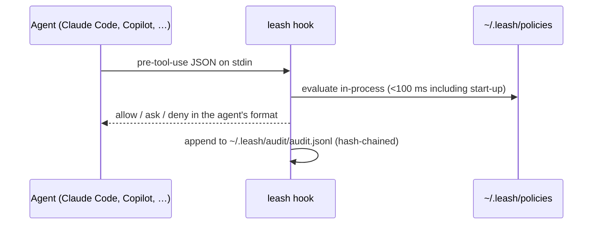

# Coding Agents (Hooks)

Leash can guard **Claude Code**, **GitHub Copilot CLI**, **Cursor**,
**OpenAI Codex** and **[OpenClaw](openclaw-guide.md)** without a server. Each
of these agents runs a hook before it uses a tool. `leash setup` registers Leash as that hook, so every shell
command, file edit, web fetch and MCP call is checked against your YAML
policy first.

```bash
uv tool install leash      # or: pipx install leash
leash setup                # hooks every agent it finds and asks for a protection level
```

`leash install` does the same without the questions (it keeps your current level).

That's the whole setup. Useful follow-ups:

```bash
leash settings             # switch protections on or off (Strict / Balanced / Relaxed)
leash hosts                # which agents are detected and hooked
leash audit summary        # what your agents did in the last 24 hours
leash audit tail -f        # watch decisions as they happen
leash doctor               # check hooks, policies and the audit log
leash explain              # why was the last call blocked / held for approval?
leash allow                # allow it from now on (leash allow --undo reverts)
```

!!! tip "New to agents?"
    [Start Here](start-here.md) is a guided, plain-English walkthrough.

## How it works



- **No server and no network.** Decisions are made locally, so they keep working offline.
- **Leash only makes agents stricter.** When Leash allows a call, the agent's own permission prompts still apply. Leash never auto-approves anything.
- **Fail-closed.** If the hook itself errors (for example, bad input or an unreadable policy), the tool call is blocked. Set `LEASH_FAIL_OPEN=1` to let calls through instead.

## What gets installed

| Agent | User scope (default) | `--project` scope (commit it) |
|---|---|---|
| Claude Code | `~/.claude/settings.json` → `hooks.PreToolUse` | `.claude/settings.json` |
| Copilot CLI | `~/.copilot/hooks/leash.json` | `.github/hooks/leash.json` |
| Cursor | `~/.cursor/hooks.json` (`preToolUse`, `beforeShellExecution`, `beforeMCPExecution`) | `.cursor/hooks.json` |
| Codex | `~/.codex/hooks.json` | `.codex/hooks.json` |
| OpenClaw | plugin in `~/.leash/integrations/openclaw`, linked with `openclaw plugins install --link` ([guide](openclaw-guide.md)) | not supported (OpenClaw config is per user) |

- Existing settings and other hooks are kept.
- The previous file is backed up to `~/.leash/backups/` before it changes.
- Running `install` again is a no-op. `leash uninstall` removes only Leash's entries.
- User-scope hooks run this Leash install by its absolute path.
- Project-scope hooks run `leash` from `PATH`, so everyone who works in the repo (including CI or cloud agents) needs Leash installed.

```bash
leash install claude-code copilot   # specific agents
leash install --project             # repo-level config in the current directory
leash install --dry-run             # print what would be written
leash uninstall                     # remove from every agent
```

!!! note "Codex"
    Codex asks you to trust new hooks. After `leash install codex`, open Codex and run `/hooks` to approve it.

## The policy

On first install, `~/.leash/policies/` is created with the bundled presets.
For existing installs, the **coding-agent** preset (`coding_agent.yaml`) is
added. It applies to agents named `claude-code*`, `copilot*`, `cursor*`,
`codex*` and `openclaw*`, and:

- **Blocks** destructive commands (`rm -rf /`, `rm -rf ~`, `mkfs`, `dd of=/dev/…`, piping `curl` into `sh`).
- **Blocks** reading credentials (`~/.ssh`, `~/.aws/credentials`, `~/.config/gh/hosts.yml`, `.netrc`, `.pypirc`, …).
- **Blocks** the agent from editing Leash or its own hook settings, and from running `leash allow` or `leash uninstall`.
- **Asks** before `sudo`, force-pushes, `git reset --hard`, publishing packages, `terraform apply`, `kubectl delete`, reading `.env` files, or writing outside the workspace.
- **Strict level only:** asks before web fetches, `curl`/`wget`, `git clone` and package installs.

Each bundled rule has a `group:` (`tamper`, `secrets`, `destructive`, `risky`,
`outside_workspace`, `network`). `leash settings` switches groups on or off,
and the level you pick in `leash setup` is a preset set of switches; see the
[CLI reference](cli-reference.md#settings). Rules without a group always apply.
- **Allows** everything else.

Edit the file to suit you; changes apply on the next tool call. To restore the
original: `leash init --preset coding-agent --force`.

### Actions and resources

Every tool call is translated into one or more *actions*, so a single policy
works for all four agents:

| Action | Resource | From |
|---|---|---|
| `shell.exec` | the command line | Bash, `bash`/`powershell`, Shell |
| `file.read` / `file.write` / `file.delete` | absolute, symlink-resolved path | Read/Write/Edit, `view`/`create`/`edit`, `apply_patch` |
| `file.search` | directory | Grep, Glob, `rg` |
| `web.fetch` / `web.search` | URL / query | WebFetch, WebSearch, `web_fetch` |
| `agent.spawn` | sub-agent type | Task |
| `mcp.<server>.<tool>` | — (`arg.<name>` in `conditions`) | any MCP tool |
| `tool.<name>` | — | anything else |

For `shell.exec`, the full command line **and each sub-command** are checked.
Sub-commands come from splitting on `;`, `&&`, `||` and `|`, and from inside
`$(…)` and backticks, with `sudo`, `env` and `VAR=` prefixes removed. So
`npm test && sudo rm -rf ~` is caught by a rule for `rm -rf ~*`. The strictest
result wins.

File actions get an `in_workspace` condition. It is true when the path is
under the agent's working directory or workspace roots.

```yaml
- action: "file.write"
  effect: ask
  reason: "Writing outside the workspace needs your approval"
  conditions:
    in_workspace: false
```

### The `ask` effect

`effect: ask` hands the decision to you: the agent shows its normal approval
prompt with Leash's reason. Some agents can't prompt everywhere:

| Agent | `ask` behavior |
|---|---|
| Claude Code, Copilot CLI | Prompts |
| Cursor | Prompts for shell and MCP calls; blocks other tools |
| Codex | Blocks (Codex hooks can't prompt) |
| OpenClaw | Pauses for `/approve` (allow once or deny) |
| Leash server `/authorize` | Blocks with "Requires human approval" |

When a hook allows a call it prints nothing (or `{}`): an empty answer means
"no objection", and the agent carries on with its normal permission checks.

### Allowing something Leash flagged

You rarely need to edit YAML to make an exception:

```bash
leash explain                      # the most recent deny/ask, in plain English, with options
leash explain 3                    # the third most recent
leash allow                        # always allow exactly that call, for that agent
leash allow --pattern '/Users/me/notes/*'   # ...or everything matching a glob
leash allow --all-agents           # ...for every agent, not just the one that was flagged
leash allow --dry-run              # show the rule without saving it
leash allow --undo                 # remove the last rule you added
```

Rules go into `~/.leash/policies/my_rules.yaml` (`priority: 100`, so they're
checked before the presets). `leash allow` shows the rule and asks you to
confirm; it needs an interactive terminal unless you pass `--yes`, and the
coding-agent preset denies agents from running it.

### Testing rules

```bash
leash policy test --local \
  -a shell.exec -r "git push --force" -r "npm test" \
  -a file.read -r ~/.ssh/id_ed25519 \
  -a mcp.github.create_pull_request
```

Each `-r` belongs to the `-a` before it. `--agent` defaults to `claude-code`.
`--strict` exits 1 if any check is denied or needs approval, which is useful in
CI.

## Audit log

Every decision is appended to `~/.leash/audit/audit.jsonl` (mode 0600). Each
line holds the SHA-256 of the line before it, so edits, deletions and
reordering are detectable:

```bash
leash audit tail -n 50       # recent decisions (--json for raw lines, -f to follow)
leash audit verify           # check the hash chain
```

Set `LEASH_AUDIT_LOG` to write somewhere else. `leash audit summary` gives a
plain-English overview. To send the log to Splunk, Elastic or another SIEM,
see [Logs & SIEM](logs-and-siem.md).

## Rolling out gradually

`LEASH_MODE=observe` records what *would* have been blocked (as
`observe_deny` / `observe_ask`) but never blocks. Set it in the environment
you start the agent from, run for a while, then check `leash audit tail`.

## Environment variables

| Variable | Effect |
|---|---|
| `LEASH_HOME` | State directory (default `~/.leash`) |
| `LEASH_MODE=observe` | Log, never block |
| `LEASH_FAIL_OPEN=1` | Allow tool calls if Leash itself errors |
| `LEASH_AGENT` | Agent name used for policy matching (default: the host name, e.g. `claude-code`) |
| `LEASH_AUDIT_LOG` | Audit log path |

## Limitations

- Hooks govern what the agent asks its tools to do. A command can still do more than its text shows (e.g. `python script.py` running a script the agent wrote earlier). Combine Leash with the agent's own sandboxing for defense in depth.
- Shell matching uses glob patterns on the command text. It is a guardrail against mistakes and prompt injection, not a sandbox.
- Cursor cloud agents don't fire `beforeMCPExecution`.
- Agents without hooks (for example Claude Desktop) can use the [MCP proxy](mcp-proxy-guide.md) for MCP tools.
